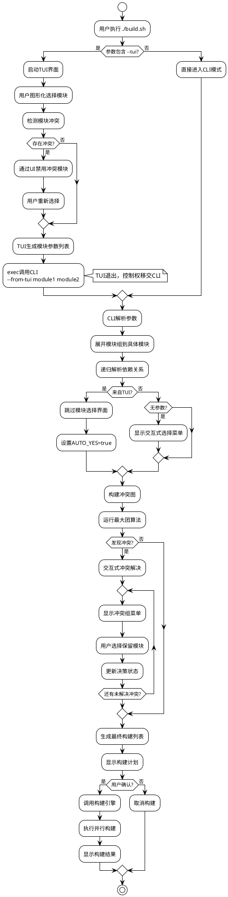
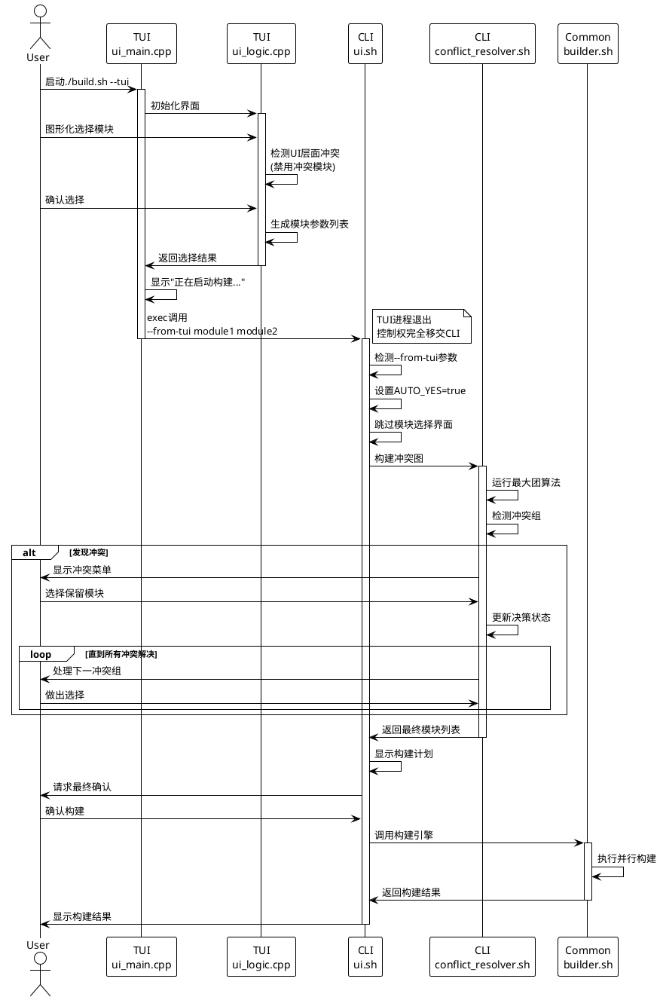

# 🏗️ Sunray TUI/CLI 统一架构重构文档

## 📊 架构概述

### 核心决策：Linus式"好品味"设计原则

遵循Linus Torvalds的设计哲学，采用**选项A - TUI退出后调用CLI**的编译集成方式：

- ✅ **消除特殊情况**：TUI只是高级参数生成器
- ✅ **复用现有逻辑**：所有构建、错误处理、依赖解析都复用
- ✅ **分离关注点**：UI负责交互，builder负责构建
- ✅ **零破坏性**：现有用户工作流完全不变

### 关键改进：差异化冲突处理

- **TUI冲突处理**：使用UI禁用状态，直观的视觉冲突指示
- **CLI冲突处理**：使用交互式菜单系统，基于冲突图的最大团算法

## 🎯 系统架构图

```plantuml
@startuml
!theme plain

skinparam componentStyle rectangle
skinparam backgroundColor White
skinparam component {
    BackgroundColor LightBlue
    BorderColor DarkBlue
}

package "Sunray 构建系统" {
    
    component "build.sh\n主入口" as MainEntry {
        note right : 保持不变\n路由到TUI/CLI
    }
    
    package "Common 共享引擎" as Common {
        component "builder.sh\n构建引擎" as Builder
        component "utils.sh\n工具函数" as Utils
        component "config.sh\nCLI配置解析器" as ConfigCLI
    }
    
    package "CLI 命令行界面" as CLI {
        component "ui.sh\nCLI交互逻辑" as CLIUI
        component "conflict_resolver.sh\n冲突解决算法" as ConflictResolver
        note bottom of ConflictResolver : 基于冲突图\n最大团算法\n交互式菜单
    }
    
    package "TUI 图形界面" as TUI {
        component "main/ui_main.cpp\n程序入口" as TUIMain
        component "core/ui_state.cpp\n状态管理" as TUIState  
        component "core/ui_logic.cpp\n业务逻辑" as TUILogic
        component "render/ui_renderer.cpp\n渲染引擎" as TUIRenderer
        component "config/config_loader.cpp\nTUI配置解析器" as ConfigTUI
        component "system/coordinate_mapper.cpp\n坐标系统" as CoordMapper
        note bottom of ConfigTUI : 独立YAML解析器\n与CLI不共享
    }
    
    database "modules.yaml\n模块配置" as ModulesYAML
    
    ' 连接关系
    MainEntry -down-> CLI : --cli
    MainEntry -down-> TUI : --tui
    
    CLI -down-> Common
    TUI -right-> CLI : exec调用\n--from-tui参数
    
    CLIUI <-down-> ConflictResolver
    ConfigCLI <-down-> ModulesYAML
    ConfigTUI <-down-> ModulesYAML
    
    TUIMain -down-> TUIState
    TUIMain -down-> TUILogic  
    TUIState <-down-> TUIRenderer
    TUILogic <-down-> CoordMapper
}

user as User
User -down-> MainEntry : ./build.sh
User -down-> TUI : 可视化选择
User -down-> CLI : 命令行参数

@enduml
```

## 🔄 数据流程图



## 📁 文件结构对比图

```plantuml
@startuml
!theme plain

skinparam node {
    BackgroundColor LightYellow
    BorderColor DarkGreen
}

node "重构前" as Before {
    folder "buildscripts/" {
        file "build.sh"
        folder "common/" {
            file "builder.sh"
            file "utils.sh" 
            file "config.sh"
        }
        folder "cli/" {
            file "ui.sh"
        }
        folder "tui/" {
            file "ui_tui.cpp" as OldTUI #LightCoral
            note right : 670行\n过于臃肿
            file "ui_core.cpp"
            file "include/..."
        }
        file "modules.yaml"
    }
}

node "重构后" as After {
    folder "buildscripts/" {
        file "build.sh"
        folder "common/" {
            file "builder.sh"
            file "utils.sh"
            file "config.sh"
        }
        folder "cli/" {
            file "ui.sh" #LightGreen
            note right : 增强--from-tui支持
            file "conflict_resolver.sh" #LightGreen
            note right : 新增\n冲突解决算法
        }
        folder "tui/" {
            folder "main/" #LightGreen {
                file "ui_main.cpp"
                note right : ~150行
            }
            folder "core/" #LightGreen {
                file "ui_state.cpp"
                note right : ~400行
                file "ui_logic.cpp" 
                note right : ~300行
            }
            folder "render/" #LightGreen {
                file "ui_renderer.cpp"
                note right : ~500行
                file "ui_components.hpp"
                note right : ~200行
            }
            folder "config/" {
                file "config_loader.cpp"
                note right : 独立解析器
            }
            folder "system/" {
                file "coordinate_mapper.cpp"
                file "terminal_guard.hpp"
            }
        }
        file "modules.yaml"
    }
}

Before -right-> After : 重构

@enduml
```



## ⏱️ TUI→CLI移交时序图



## 🔧 关键技术实现

### 1. TUI→CLI移交机制

```cpp
// TUI完成选择后的代码
void UILogic::execute_build() {
    auto selected_modules = get_selected_modules();
    std::string cli_args = format_cli_arguments(selected_modules);
    
    // 显示移交信息
    display_transition_message("正在启动构建引擎...");
    
    // 构建命令
    std::string build_cmd = get_buildscripts_dir() + "/../build.sh --cli --from-tui " + cli_args;
    
    // 执行CLI构建
    execl("/bin/bash", "bash", "-c", build_cmd.c_str(), nullptr);
}
```

### 2. CLI增强支持--from-tui

```bash
# 在cli/ui.sh中增加
parse_arguments() {
    while [[ $# -gt 0 ]]; do
        case $1 in
            --from-tui)
                FROM_TUI=true
                AUTO_YES=true  # 跳过最终确认
                VERBOSE=false  # 减少冗余输出
                shift
                ;;
            # ... 其他参数处理
        esac
    done
    
    if [[ "$FROM_TUI" == true ]]; then
        # TUI已经完成模块选择，直接使用传入的模块列表
        SELECTED_MODULES=("$@")
        print_status "接收来自TUI的模块选择: ${SELECTED_MODULES[*]}"
    fi
}
```

### 3. CLI冲突解决算法集成

基于提供的CLI冲突解决算法文档，实现以下组件：

```bash
# conflict_resolver.sh
resolve_conflicts_interactive() {
    local modules=("$@")
    local conflict_groups=($(detect_conflict_groups "${modules[@]}"))
    
    for group in "${conflict_groups[@]}"; do
        if ! is_conflict_resolved "$group"; then
            show_conflict_menu "$group"
            process_user_choice "$group"
        fi
    done
    
    return "${final_module_list[@]}"
}
```

## 📊 性能指标

### 代码组织改进
- **重构前**: ui_tui.cpp 670行
- **重构后**: 
  - ui_main.cpp ~150行
  - ui_state.cpp ~400行  
  - ui_logic.cpp ~300行
  - ui_renderer.cpp ~500行
  - ui_components.hpp ~200行

### 功能边界清晰度
- **TUI职责**: 用户交互、视觉冲突指示、参数生成
- **CLI职责**: 构建执行、复杂冲突解决、系统集成

## ✅ 成功标准

1. **代码质量**: TUI单文件行数 < 400行
2. **功能完整**: TUI选择完成后自动调用CLI构建
3. **用户体验**: 现有CLI用户体验无变化
4. **架构独立**: TUI和CLI使用独立的YAML解析器
5. **构建稳定**: 构建成功率和错误处理保持一致

## 🚨 风险控制

- **向后兼容**: 现有CLI用户完全不受影响
- **功能完整**: TUI所有现有功能保持不变
- **渐进实施**: 可以逐步实施，每步都可回滚
- **测试覆盖**: 完整的TUI→CLI流程测试

---

*本文档遵循Linus Torvalds的"好品味"设计原则，强调简单、可靠、易维护的架构方案。*