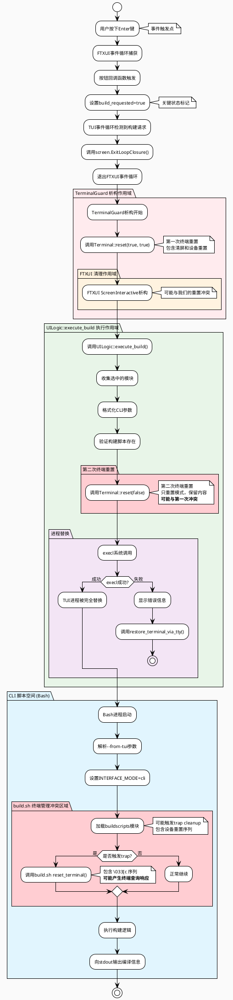

# TUI 编译按钮触发后全流程深度诊断

## 1. PlantUML 层级流程图



## 2. 分步详解

### ---------- TUI 应用空间 (C++) ----------

#### 步骤 1: 捕获"编译"按钮点击事件

**[负责文件]**: `buildscripts/tui/src/render/ui_renderer.cpp`

**[核心动作]**: FTXUI 的事件循环捕获到用户在"编译"按钮上按下了 Enter 键，并调用了与之绑定的回调函数。

**[详细说明]**: 在`ui_renderer.cpp`的`create_component()`函数中，构建按钮通过FTXUI的事件处理机制绑定。当用户聚焦到构建按钮并按下Enter时，会触发相应的事件处理逻辑。

**[🕵️‍♂️ 潜在故障点 / 调试方向]**:

- 按钮的事件绑定是否正确？检查`create_component()`中构建按钮的事件处理代码
- 是否有其他事件（如全局的 OnEvent 捕获）提前拦截并处理了 Enter 键？检查`CatchEvent`包装器中的事件处理逻辑
- 调试建议：在按钮事件处理的第一行添加 `DEBUG_STATE(state_.debug_logger, "ButtonClick", "Build button activated")`

#### 步骤 2: 设置构建请求标志

**[负责文件]**: `buildscripts/tui/src/render/ui_renderer.cpp`, `buildscripts/tui/include/ui_core.hpp`

**[核心动作]**: 按钮事件处理函数设置 `state_.build_requested = true`，标记用户请求开始构建。

**[详细说明]**: 在按钮事件处理中，会设置UIState中的build_requested标志为true，同时调用debug日志记录此操作。这是一个关键的状态标记，用于通知TUI主循环需要退出并开始构建。

**[🕵️‍♂️ 潜在故障点 / 调试方向]**:

- `state_.build_requested`是否被正确设置？检查UIState结构中该字段的定义
- 状态设置后是否立即生效？检查是否有其他代码路径会重置此标志
- 调试建议：在设置后立即输出日志确认状态变更：`std::cout << "build_requested set to: " << state_.build_requested << std::endl;`

#### 步骤 3: TUI事件循环检测并退出

**[负责文件]**: `buildscripts/tui/src/render/ui_renderer.cpp` (run_with_build_callback函数)

**[核心动作]**: TUI主循环中的`CatchEvent`包装器检测到`build_requested`标志，调用`screen.ExitLoopClosure()()`退出FTXUI事件循环。

**[详细说明]**: 在`run_with_build_callback`函数中，有一个`CatchEvent`包装器持续监测`state_.build_requested`标志。一旦检测到为true，立即调用screen的退出回调，优雅地结束FTXUI的事件循环。

**[🕵️‍♂️ 潜在故障点 / 调试方向]**:

- 事件循环是否及时检测到状态变化？检查`CatchEvent`中的逻辑是否每次事件都会检查
- `screen.ExitLoopClosure()()`调用是否成功？验证screen对象的有效性
- 退出是否过于突然导致状态不一致？检查是否需要在退出前添加延迟或清理逻辑
- 调试建议：在退出前添加：`DEBUG_STATE(state_.debug_logger, "TUILoop", "About to exit TUI loop");`

#### 步骤 4: TerminalGuard析构和终端清理

**[负责文件]**: `buildscripts/tui/include/terminal_guard.hpp`, `buildscripts/tui/include/terminal_core.hpp`

**[核心动作]**: FTXUI事件循环退出后，`TerminalGuard`对象超出作用域开始析构，调用`Terminal::reset(true, true)`进行终端状态重置。

**[详细说明]**: 在`run_with_build_callback`函数中，`TerminalGuard guard;`创建的RAII对象会在作用域结束时自动析构。析构函数调用`Terminal::reset(true, true)`，发送包含清屏和设备重置的完整ANSI序列。

**[🕵️‍♂️ 潜在故障点 / 调试方向]**:

- TerminalGuard析构时机是否正确？它应该在FTXUI完全退出后但execl之前析构
- `Terminal::reset(true, true)`的序列是否与后续的`Terminal::reset(false)`产生冲突？
- 是否存在析构顺序问题？检查其他RAII对象的析构是否影响终端状态
- 调试建议：在TerminalGuard析构函数中添加日志，确认调用时机和参数

#### 步骤 5: FTXUI ScreenInteractive析构

**[负责文件]**: FTXUI库内部代码 (第三方库)

**[核心动作]**: FTXUI的`ScreenInteractive`对象析构，可能会发送自己的终端恢复序列。

**[详细说明]**: 当`screen`对象超出作用域时，FTXUI库会执行自己的清理逻辑，包括终端状态恢复。这可能与我们的`Terminal::reset`产生冲突或重复操作。

**[🕵️‍♂️ 潜在故障点 / 调试方向]**:

- FTXUI的析构是否覆盖了我们的终端设置？这是最可能的问题根源
- 析构顺序是否正确？TerminalGuard应该在ScreenInteractive之后析构以确保最终状态
- FTXUI是否发送了我们不希望的终端序列（如清屏）？
- 调试建议：修改作用域顺序，让ScreenInteractive先析构：

  ```cpp
  {
      auto screen = ScreenInteractive::Fullscreen();
      // ... screen usage
  } // screen析构
  // 然后手动调用terminal reset
  ```

#### 步骤 6: 收集并格式化待编译模块

**[负责文件]**: `buildscripts/tui/src/core/ui_logic.cpp`, `buildscripts/tui/include/ui_core.hpp`

**[核心动作]**: 从UIState中获取所有被用户勾选的模块，并将它们的名称格式化成空格分隔的字符串。

**[详细说明]**: `execute_build()`函数调用`get_selected_modules()`遍历模块状态，收集所有`is_selected == true`的模块，然后通过`format_cli_arguments()`格式化为命令行参数字符串。

**[🕵️‍♂️ 潜在故障点 / 调试方向]**:

- 模块选择状态是否被正确保存？检查用户勾选操作是否更新了underlying state
- 模块名中是否包含特殊字符需要转义？检查space, quotes等字符的处理
- 是否有模块选择但最终没有被包含？验证state遍历逻辑的完整性
- 调试建议：输出选中的模块列表：`std::cout << "Selected modules: " << cli_args << std::endl;`

#### 步骤 7: 执行第二次终端重置 (关键步骤)

**[负责文件]**: `buildscripts/tui/src/core/ui_logic.cpp` 中的 `execute_build()` 函数

**[核心动作]**: 在execl之前，再次调用`sunray_tui::Terminal::reset(false)`，使用保留屏幕内容的序列进行"无缝"终端恢复。

**[详细说明]**: 这是实现无缝TUI→CLI切换的核心步骤。调用`Terminal::reset(false)`会选择`RESET_PRESERVE_CONTENT`序列，包含`\033[?1049l`(退出备用屏幕)但不包含`\033[2J`(清屏)。

**[🕵️‍♂️ 潜在故障点 / 调试方向]**:

- **关键问题**：这次reset是否与之前TerminalGuard的reset产生冲突？两次reset可能导致终端状态混乱
- ANSI序列是否完整且正确？特别是`\033[?1049l`序列是否适用于当前终端
- 时序问题：reset调用与execl之间是否有足够的处理时间？可能需要添加短暂延迟
- 调试建议：临时注释掉这次reset，看问题是否来源于双重reset冲突

### ---------- 进程移交 ----------

#### 步骤 8: 执行 execl 系统调用

**[负责文件]**: `buildscripts/tui/src/core/ui_logic.cpp`

**[核心动作]**: TUI 进程使用 execl 将自身替换为 /bin/bash 进程，并指示 bash 执行 build.sh 脚本和携带的参数。

**[详细说明]**: `execl("/bin/bash", "bash", "-c", full_cmd.c_str(), nullptr)`调用会完全替换当前进程，所有TUI代码和内存状态都会消失，控制权移交给新的Shell进程。

**[🕵️‍♂️ 潜在故障点 / 调试方向]**:

- 构建脚本路径是否正确？检查`get_project_root_dir()`的路径解析逻辑
- build.sh文件是否有可执行权限？运行`ls -la build.sh`确认权限
- execl参数是否正确？特别是`full_cmd`的构造是否包含所有必要参数
- execl失败处理：当前代码在execl失败时会调用`restore_terminal_via_tty()`，检查这个恢复逻辑是否正确
- 调试建议：在execl前输出完整命令：`std::cout << "Executing: " << full_cmd << std::endl;`

### ---------- CLI 脚本空间 (Bash) ----------

#### 步骤 9: build.sh 开始执行和参数解析

**[负责文件]**: `build.sh`, `buildscripts/cli/ui.sh`

**[核心动作]**: Bash 脚本开始执行，解析传入的 `--from-tui` 标志和模块列表参数。

**[详细说明]**: build.sh检测到`--cli`和`--from-tui`参数，设置`INTERFACE_MODE="cli"`和`FROM_TUI=true`，然后加载CLI模式的UI脚本进行后续处理。

**[🕵️‍♂️ 潜在故障点 / 调试方向]**:

- 参数解析是否正确识别`--from-tui`模式？检查build.sh中的参数解析逻辑
- 脚本启动时是否输出了干扰性的控制字符？检查脚本开头是否有意外的echo或printf语句
- 环境变量是否正确传递？特别是路径相关的环境变量
- 调试建议：在脚本开头添加调试输出：`echo "DEBUG: Started with args: $*" >&2`

#### 步骤 10: 终端状态冲突处理

**[负责文件]**: `build.sh` 中的 `reset_terminal()` 函数

**[核心动作]**: build.sh中也定义了自己的`reset_terminal()`函数，并通过trap机制在脚本退出时调用。

**[详细说明]**: build.sh中有重复定义的`reset_terminal()`函数（在22-51行和78-108行），还有trap清理机制。这可能与TUI的终端重置产生冲突。

**[🕵️‍♂️ 潜在故障点 / 调试方向]**:

- **严重问题**：build.sh中的`reset_terminal()`包含`printf '\033[c'`设备重置序列，这会触发终端查询响应，可能产生控制字符污染
- 重复定义问题：两个相同的`reset_terminal()`函数定义可能导致混乱
- trap机制是否与TUI的终端管理冲突？检查trap是否在不合适的时机触发
- 调试建议：临时禁用build.sh中的所有终端重置逻辑，测试问题是否来源于此

#### 步骤 11: 编译输出显示

**[负责文件]**: `buildscripts/cli/ui.sh`, `buildscripts/common/builder.sh`

**[核心动作]**: CLI脚本开始执行实际的模块构建，向stdout输出编译进度和结果信息。

**[详细说明]**: 脚本进入主构建流程，调用各种构建函数并向标准输出打印编译信息。这些输出应该直接显示在用户的终端中。

**[🕵️‍♂️ 潜在故障点 / 调试方向]**:

- 输出是否被正确显示？检查终端缓冲区和输出重定向
- 输出格式是否因终端状态异常而混乱？检查颜色代码和格式化字符
- 构建输出是否被意外清除？这可能是备用屏幕缓冲区切换问题
- 调试建议：在构建开始前输出明确的分隔符：`echo "=== BUILD OUTPUT STARTS HERE ==="`

## 🎯 重点调试建议

1. **双重终端重置冲突**：最可能的问题根源是TerminalGuard析构时的reset与execute_build中的reset产生冲突
2. **FTXUI析构顺序**：确保ScreenInteractive在我们的终端清理之前析构
3. **build.sh中的设备重置**：移除build.sh中的`\033[c`序列以避免终端查询响应
4. **备用屏幕缓冲区管理**：验证`\033[?1049l`序列在不同终端环境下的行为一致性

## 📊 问题优先级排序

### 🔴 高优先级 (最可能的根本原因)

1. **双重终端重置**：TerminalGuard + execute_build 中的重复reset调用
2. **FTXUI析构冲突**：ScreenInteractive析构与我们的终端管理冲突
3. **build.sh设备重置序列**：`\033[c`序列触发终端查询响应

### 🟡 中优先级 (需要验证的问题)

1. **析构顺序问题**：RAII对象的析构时机和顺序
2. **备用屏幕缓冲区状态**：`\033[?1049l`序列的跨终端兼容性
3. **execl参数传递**：命令构造和参数转义问题

### 🟢 低优先级 (辅助调试信息)

1. **模块状态一致性**：用户选择的模块是否正确传递
2. **路径解析问题**：项目根目录和脚本路径的正确性
3. **权限和环境**：文件权限和环境变量传递

这份诊断文档应该能帮助您按图索骥，精确定位TUI退出后终端状态异常的根本原因。建议从高优先级问题开始逐一排查。